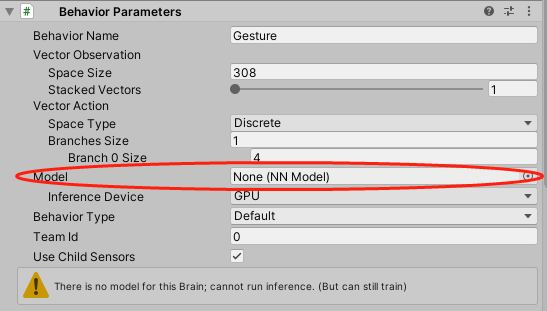

# Evaluate your model

## Evalute from Command Line

You can evaluate your trained model from the command to log all metrics:
1. Open a command window.
2. Navigate to `Assets/Logs`.
3. Run `mlagents-learn config_gesture_ppo.yaml --run-id=<your_eval_id> --initialize-from=<your_model_id> --inference`.
    - `run-id` should be the name of your evaluation session.
    - `initialize-from` should be the name of the traning session your model belongs to.
4. Click **Play** from Unity editor to start evaluation.

Note that your environment and agent settings should be the same as your trained model.

The evaluation will be stopped when 1000 episodes are reached by default. All the metrics will be saved to your `run-id`, and you can check them just like observing [training](Training.md) using TensorBoard.

## Evaluate in Unity

You can also evaluate your model in Unity with the `.nn` file generated in each training session. Unity has a powerful inference engine that can process the neural networks. However, you are not able to view the evalution statistics using this method.

To start evaluation, drag your model from **Project** window to the `Behavior Parameters` component from `Embodied Agent`. After that, click **Play**, and you will be able to see the agent navigate with a "trained brain"!

