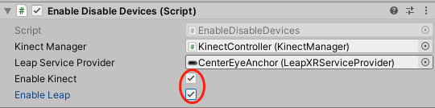
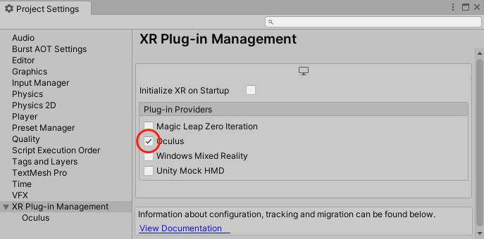
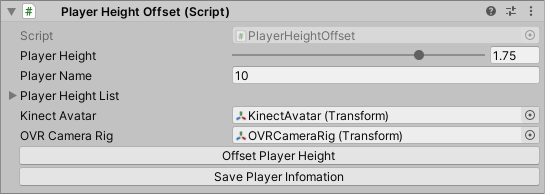
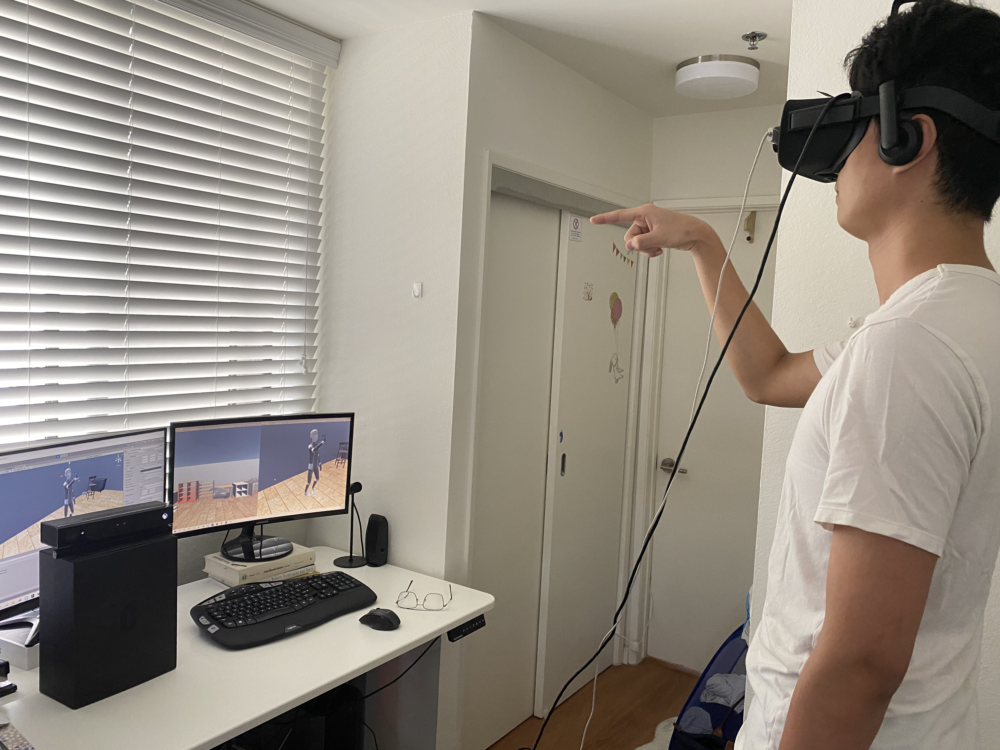
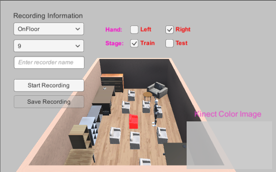
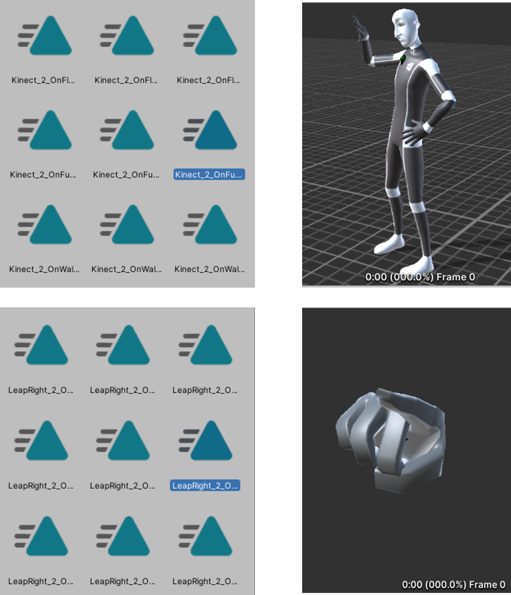

# Gesture Recording

If you would like to record your own gestures, please have devices ready and required software installed according to the [installation](Installation.md) file. You need to enable Kinect and Leap Motion from `Enable Disable Devices (Script)` component in `Human Interaction Modules` from the **Inspector** window. 

To enable Oculus in Unity, open `Edit/Project Settings/XR Plug-in Management` from menu, and allow Oculus plug-in by selecting it.

## Before Recording

### Log Player Information

`Player Height Offset (Script)` component in `Human Interaction Modules` logs player information and adjusts the size of the Kinect character. Enter player height (in m) and player name, click `Save Player Information` and then `Offset Player Height`. The Kinect character will scale according to the player's height. The names and heights of all players can be found in `Player Height List`.

### Display Kinect Image

If you want to see your self images during recording, enable `Display Kinect Image` in the `Tracking Display` component. The color images taken from Kinect camera will be displayed at the lower right corner from the recording panel.

### Device Arrangement

Device arrangement should comply with the part explained in the orignal paper. You should mount Leap Motion on your Oculus headset and let the user wear the headset correctly. The player should stand about 1.5m away from Kinect and Kinect should be placed above ground at 1.5m or so. Make sure the user is facing Kinect and he/she looks ahead.

## Take Recordings

To start recording, activate `PlayArea/PosReceptacles_filled` and deactivate `PlayArea/Embodied Agent` from **Hierarchy**. After that, simply click the Play button in Unity editor and you will enter the play mode.

In the **Game** window, switch display to `Display 1`, and you will see the recording panel. You should select from the following options:
- Object category: 3 options to choose: On Floor, On Furniture Top, and On Wall.
- Object location index: 10 options from 0 to 9, corresponding to 10 different locations in each category. A dummy target will be marked with red color to guide the user.
- User name: enter the user name here to match each recording with the correct user.
- Handness: left or right, depending on which hand the player is using for referencing.
- Stage: train or test, if you want to use the recording for training or testing.

The Kinect image will be displayed on the lower right if you enable it.

To start a recording, click `Start Recording`. Ask the user to make a referencing gesture to the current target marked with red. To stop the recording, click `Stop Recording`. If you want to save this recording, click `Save Recording` after you stop it. 3 animation clips will be saved, corresponding to Kinect body, left Leap hand, and right Leap hand.

## Check Recordings

All the recordings will be saved under `Assets/Resources` from the **Project** window. Each player's recordings are separated by the unique name. They should all have `.anim` suffix.

To check a recording, click it from the **Project** window. In the **Inspector** window, you will be able to see the recording information, including how many curves (you can understand a curve as a data point) are saved by this clip. If you want to have a preview, you need to drag the corresponding model to the preview area. For Kinect body, drag `PlayArea/Human Interaction Modules/Kinect Rig/Kinect Avatar` to it. For left Leap hand, drag `PlayArea/Human Interaction Modules/Leap Rig/Hand Models/RiggedHandLeft`, and for right Leap hand, drag drag `PlayArea/Human Interaction Modules/Leap Rig/Hand Models/RiggedHandRight`. You will be able to see something similar to the figure below.

