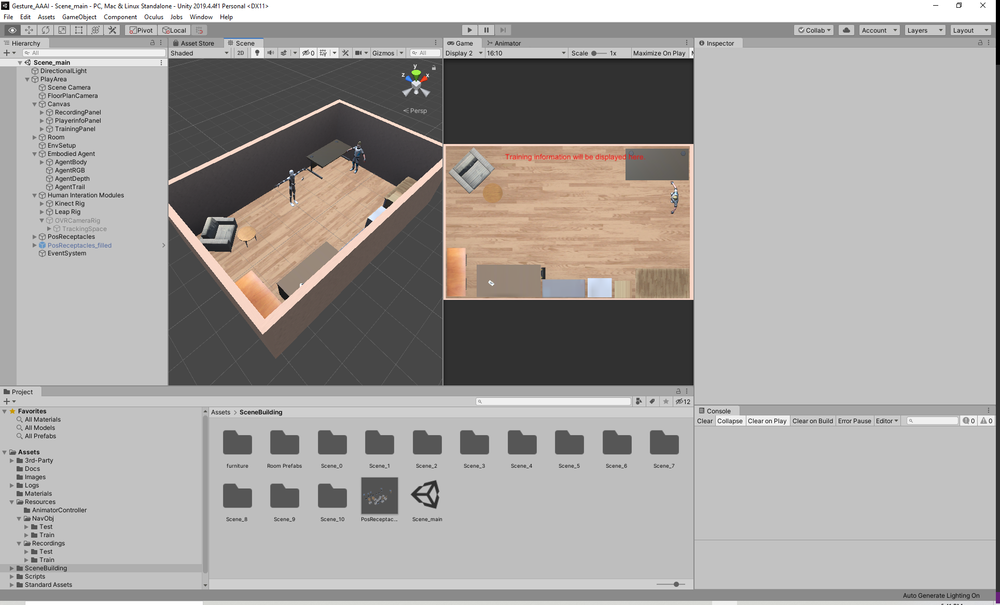

# Installation

To use this package, you will have to follow the next few steps:

## Install Unity

This package requires Unity version 2019.4.4 or later. You can download Unity from [here](https://unity3d.com/get-unity/download). Once you finish installation, create a new project and drag the entire package under the `Assets` folder in the **Project** window. If you go to `Assets/SceneBuilding` folder and click on the **Scene_main** file, you will be able to see the main scene used for training and testing.

## Install ML-Agents Toolkit

The Unity Machine Learning Agents Toolkit ([ML-Agents](https://github.com/Unity-Technologies/ml-agents)) is an open-source project that enables games and simulations to serve as environments for training intelligent agents. We include ML-Agents as a part of the framework. To install ML-Agents, please follow the installation guide on this [page](https://github.com/Unity-Technologies/ml-agents/blob/release_6_docs/docs/Installation.md). You will need to install the Unity package and some python packages.

## Install Softwares for Devices

If you want to record your own gestures, you will need 3 devices: Oculus Rift, Mircrosoft Kinect Sensor, and Leap Motion Controller. If you do not have the required devices, you can use our recordings in `Assets/Resources/Recordings` for training or testing and neglect the following steps.

To use Oculus Rift, you need to download the software from [here](https://www.oculus.com/setup/). And to enable VR exprience in Unit, you need to install `XR Plugin Management` package from Unity **Package Manager**. For Kinect Sensor, please download [Kinect for Windows SDK 2.0](https://www.microsoft.com/en-us/download/details.aspx?id=44561). And for Leap Motion Controller, you should install [Leap Motion Orion beta](https://developer.leapmotion.com/vr-setup) from the official website.

