# Introduction

This is a getting-started guide to our environment. The readers are recommended to have some basic knowledge about Unity. If you want to have a peek about Unity, the [Roll-a-Ball](https://learn.unity.com/project/roll-a-ball-tutorial) example would be a great example. 

The whole environment is embedded with the ML-Agents toolkit. The C# SDK included in the `ML Agent` Unity package is used for scripting. For details about the toolkit, please refer to the official [documentation](https://github.com/Unity-Technologies/ml-agents/blob/release_6_docs/docs/Readme.md). Users can also build their own AI projects with this great toolkit.

## Scene Building

If you open the `Scene_main` file, you will be able to see the main scene we build for training and evaluation. The details are revealed below:

### Rooms

We have 11 available rooms available during agent navigations. In the **Hierarchy** window, go to `PlayArea/Room` and expand it, you will be able to see 11 rooms availabe in the main scene. Activate one of them and deactivate the others to see its layout. During training and testing, only one room will be activate at one time.

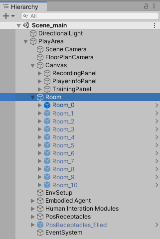

You can also find all the room prefabs under `Assets/SceneBuilding/Room Prefabs` in the **Project** window. Changes made on prefabs will be reflected in their cloned instances. In `Assets/SceneBuilding`, we put all meshes and materials used to create rooms under 'furniture', and each room also has an individual folder to hold floor and plane materials as well as an example scene.

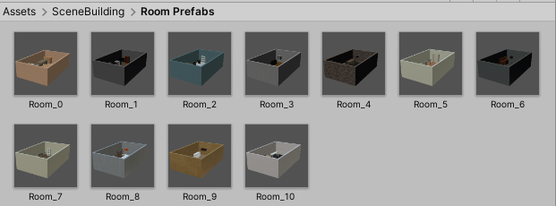

### Targets

We have 3 object categories for targets: *On Floor*, *On Furniture Top*, and *On Wall*. All navigable target object prefabs can be found under `Assets/Resources/NavObj` in the **Project** window. There are two folders, one is for training, the other one is for testing. If you click on either of them, you will be able to see 3 folders with different object categories, and each of them have all the object prefabs as well as meshes and materials available.

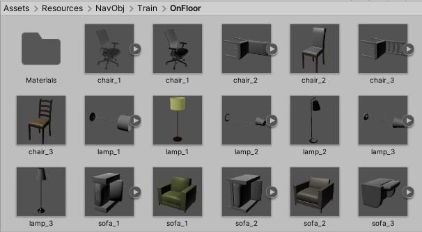

## Main Components

In this section, an overview of the main componets in our environment will be given. For further explanations on those components, please refer to [Gesture Recording](Gesture-Recording.md), [Training](Training.md), or [Evaluation](Evaluation.md) section.

### Cameras

There are several cameras can be found from the **Hierarchy** window:
- Scene camera: a bird-eye view of the environment. Recording panel is also displaed in this camera from **Game** window in `Display 1`. 
  
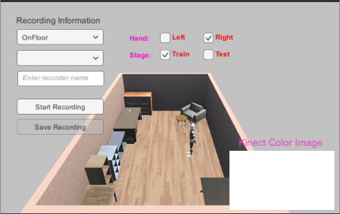

- Floor plan camera: this camera captures the top-down view of the environment. It also shows training information in `Display 2`.

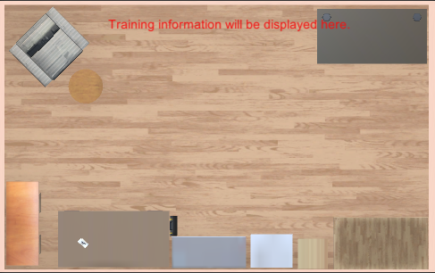

- RGB camera: it is attached to the agent and generates color images. See `Display 3` for RGB images from the agent.

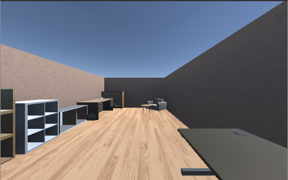

- Depth camera: it is attached to the agent and generates depth images. See `Display 4` for depth images from the agent.

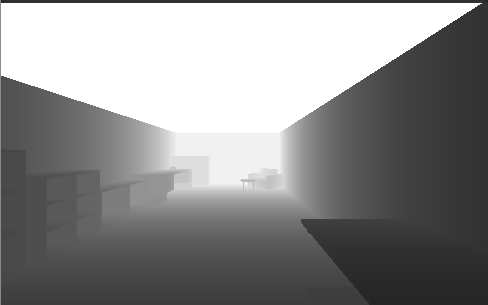

- (Optional) OVR Camera: you can find this camera component in `Human Interaction Modules/OVRCameraRig/TrackingSpace/CenterEyeAnchor`. Only use it if you intend to enable Oculus VR in Unity. It is the view from the user who wears the VR headset, also available in `Display 5`. The user can see the hands from this view.

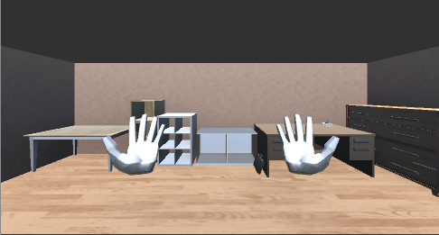

## Environmental Setup

In the **Hierarchy** window, you can see the GameObject called `EnvSetup`. This is where we set up the environment for training and testing. `Env Setup (Script)` is used to control target and room selection. `Communication Hub (Script)` controls the communications between components in the environment. Alway deselect `Is Training` if you are not in a training process and select it if you are.

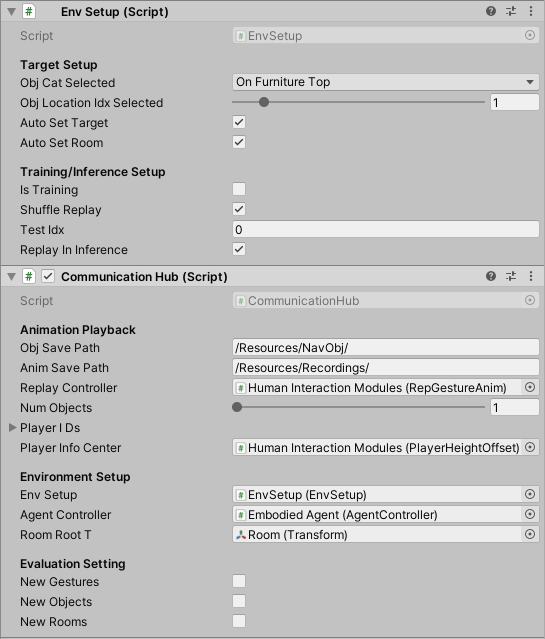

## Embodied Agent

In the **Hierarchy** window, you can see the GameObject called `Embodied Agent`. This is the embodiment of our navigation agent. From the `Agent Controller (Script)` component (see image below), you can control all the agent settings, including agent paramters, sensory inputs, and evaluation metrics. The `Behavior Parameters` has information about observation and action spaces.

The 4 child GameObjects under `Embodied Agent`:
- `AgentBody`: the body meshes and visualization of the agent
- `AgentRGB`: this is where the RGB camera is attached
- `AgentDepth`: this is where the Depth camera is attached
- `AgentTrail`: it has a `Trail Render` component that can be used to draw agent navigation path

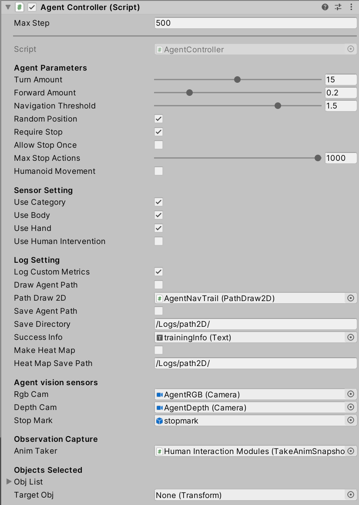

## Human Interaction Module

This GameObject coordinates different devices and manipulates recording and replaying. It is an essential hub for implementation of human-AI interaction. From this module, you can enable or disable devices, recording gestures, and replaying recorded animation clips. It contains the following child GameObject, corresponding to 3 devices we use:
- `Kinect Rig`: Kinect body is attached to it and it has a managers to communicate with Kinect Sensor. Some scripts are from Ruman Filkov (rumen.filkov@gmail.com). Thank him for the nice scripts!
- `Leap Rig`: Leap Hands are attached to it. It also sends back data from Leap Motion Controller. Some script are available from the public [Unity module](https://developer.leapmotion.com/unity#5436356).
- `OVRCameraRig`: It is used to enable tracking of the user's head when Oculus headset is worn. This prefab is available from Oculus Integration in Unity Asset Store for free.

## Pos Receptacles

As discussed in Appendix, we has a lot of position receptacles to fill the targets and used for recording. If you click on this GameObject, you will find that there is no object under it. It is because all the position receptacles are purely void receptacles and only filled with targets when necessary.

There is another GameObject, `PosReceptacles_filled`, which has all position receptacles filled with a dummy target. The dummy targets are used to guide the user during recording. Please refer to the [gesture recording](Gesture-Recording.md) for further information.

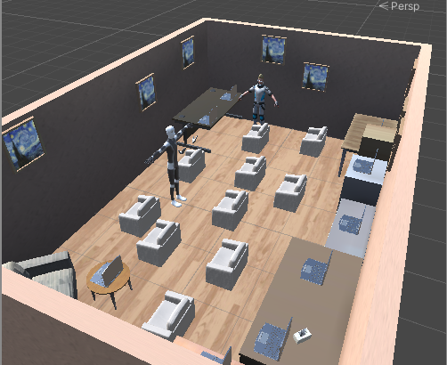