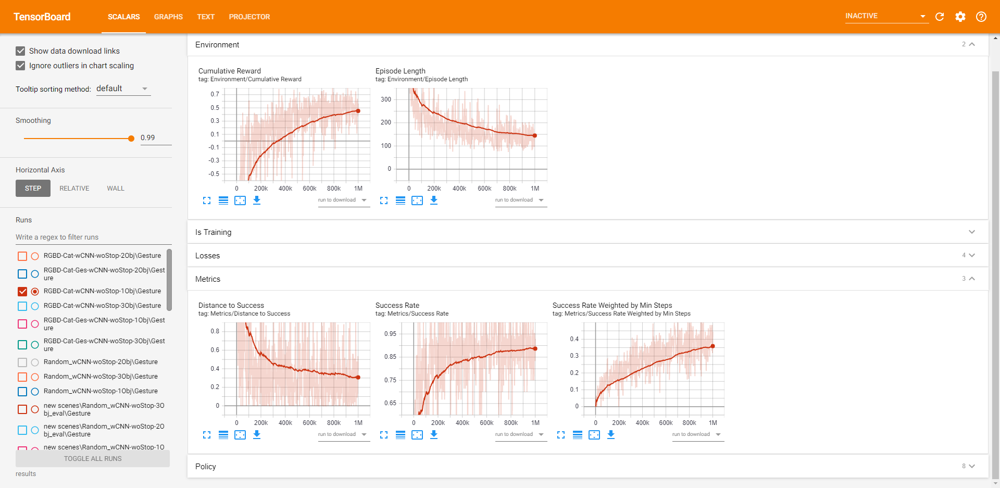

# Train your model

You can use your own recordings or our recordings for training and testing. In this documentation, we will use our recordings as an example. Make sure you activate `Embodied Agent` GameObject already.

## Agent and Environment Setup

### Agent

All agent setups are available from `Agent Controller (Script)` component in `Embodied Agent` GameObject. 

- From *Agent Parameters*, you can choose agent turn and forward amounts in each step, as well as the navigation threshold. You can also enable humanoid movement for the agent (we recommend not to use it during training for performance reasons). 
- For *Sensor Setting*, you can choose which sensors to use. Note that if you want to train a random model (blind navigation), please remove all `Camera Sensor` components from `Embodied Agent`. 
- In *Log Setting*, you decide whether to log our custom metrics (SR, SMS, DTS), or just use the TensorFlow default metrics. You can also enable path drawing from top down view to track agent movements.

### Environment

For most cases, there is only one thing to change for the environment: the number of fake targets. To change that, look it up from `Communication Hub` component in `EnvSetup`. You can modify the value of `Num Objects`. This includes the true target itself. In our experiments, we change it from 1 to 3.

## Training from Command Line

Follow the following steps to initiate training:

1. Open a command window.
2. Navigate to `Assets/Logs`. **Note**:
   If you followed the default [installation](Installation.md), then you should
   be able to run `mlagents-learn` correctly.
3. Run `mlagents-learn config_gesture_ppo.yaml --run-id=<your_run_id>`.
   - `config_gesture_ppo.yaml` is the default training
     configuration file we used. It contains all the hyperparamters for the learning model.
   - `run-id` is a unique name for this training session.
4. When the message _"Start training by pressing the Play button in the Unity
   Editor"_ is displayed on the screen, you can press the **Play** button in
   Unity to start training in the Editor.

When training is done, the checkpoints and models will be saved under `Assets/Logs/results` by its `run-id`.

## Check Training Statistics

TensorFlow has a utility, called **TensorBoard**, that can be used to observe the training process. To view all training metrics, run `tensorboard --logdir=results` from command line. After that, open a brower and navigate to `localhost:6006`. You should see something below:

Select the name of your training session, and you will be able to see our 3 metrics under the `Metrics` section. For explanation about other statistics, please refer to this [webpage](https://github.com/Unity-Technologies/ml-agents/blob/release_6_docs/docs/Using-Tensorboard.md).